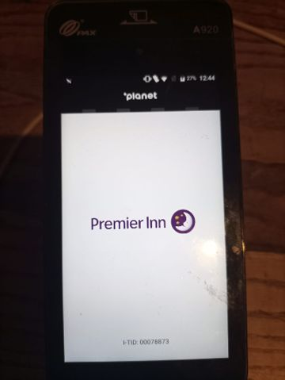
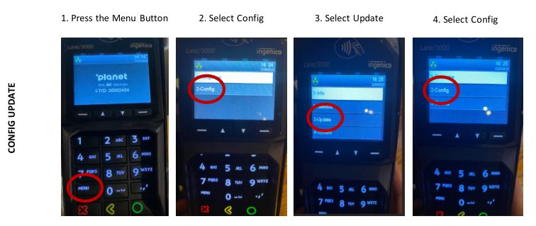
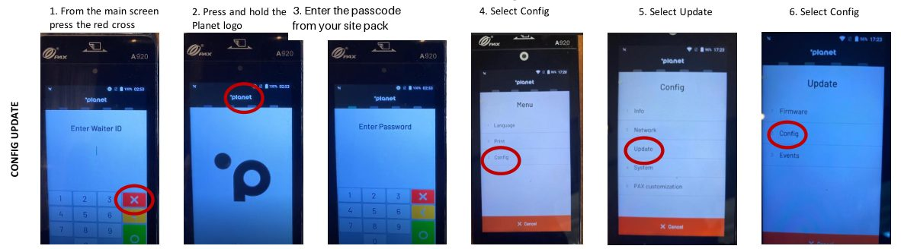
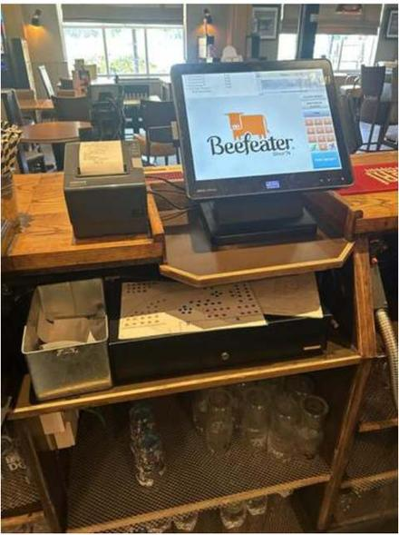
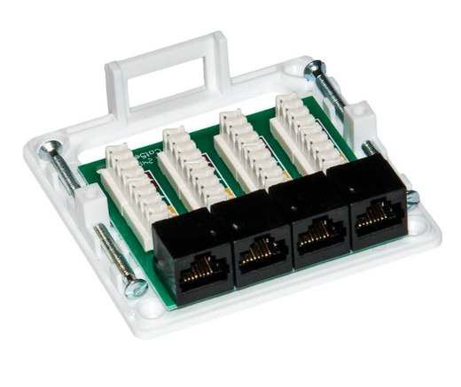
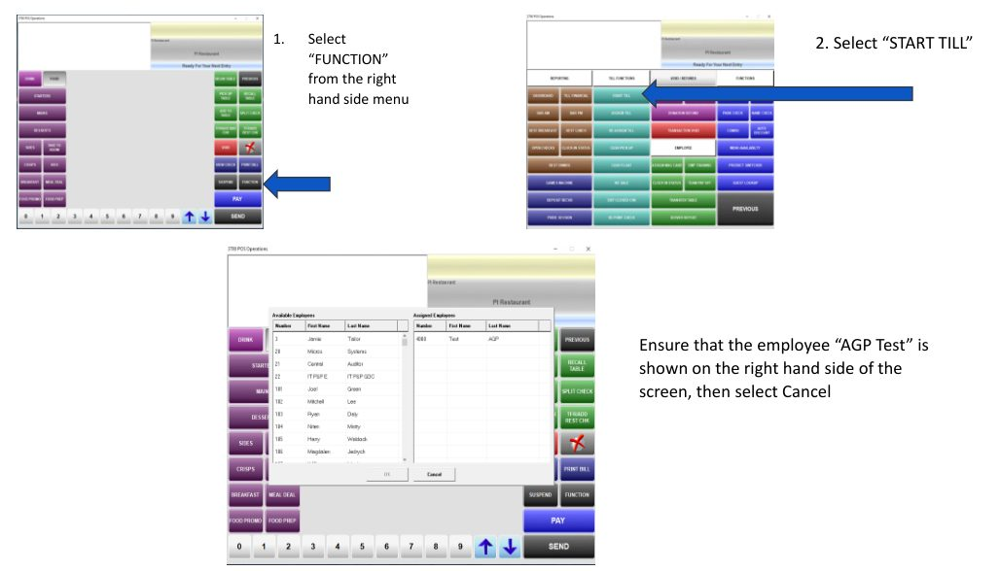
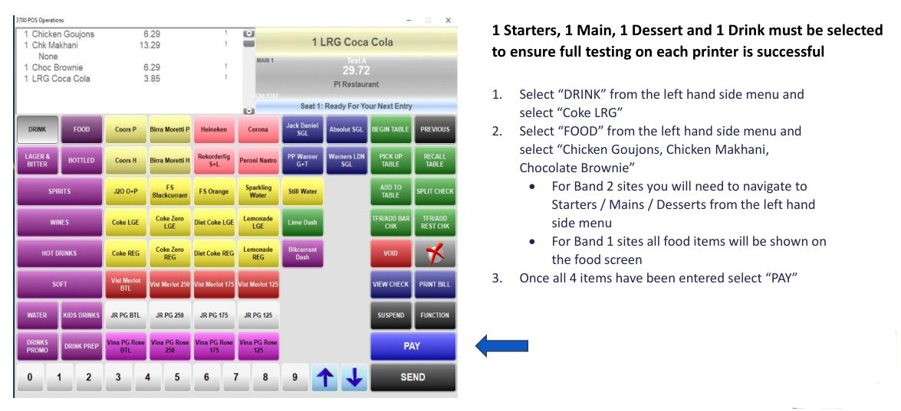

# Project Rose — Engineer Training

This course trains you to convert a Whitbread restaurant site to Premier Inn Solus as part of Project Rose. It covers the whole night, in the order you will do it: arrival, pre-requisites, PEDs, the kitchen printer, the migration script, testing, de-install, evidence and handover, and what to do when something goes wrong.

Work through the modules in order. Each one takes a few minutes and ends with two or three practice questions — these are practice, they do not count towards anything. The final assessment at the end is 20 questions with a pass mark of 90%.

Your progress is saved on this phone only. If you clear your browser data, your progress is lost and you start again.

## Module 1: The job

Project Rose converts Whitbread restaurant sites to Premier Inn Solus. The restaurant closes under its current brand, and by morning its tills and payment devices are running as Premier Inn. Your job is the overnight IT cutover at one site.

### What changes on the night

- The tills and the retained PEDs are converted from the restaurant brand to Premier Inn.
- A new kitchen printer is installed at sites that currently run a Kitchen Management System (KMS).
- The KMS is shut down and removed.
- Surplus kit is de-installed, serial numbers recorded, boxed and left for courier collection the next day.

### What stays at the site and keeps working

- Till 1 and Till 2.
- Two wired PEDs and two wireless PEDs.
- Two bar printers.

Everything else on the removal list in your site pack comes out.

### The shape of the night

There are three cutover nights: Thursday 3, Monday 7 and Thursday 10 September 2026. You work at one site per night, alone for most of it: arrive at 20:30, hand back to the manager at 06:30. Around 240 sites are being converted across the brands — Beefeater, Brewers Fayre, Table Table, Bar & Block, Cookhouse and the inns. The install is the same at every brand. What varies is mainly what gets removed, and your site pack lists exactly what that is for your site.

You are on your own at the site, but not on your own on the night. You are part of a group of about ten engineers with a lead engineer, coordinators run the night behind them, and Celestra technical support is available remotely throughout. How to reach them — and when — is Module 11.

```check
q: It is 3am and the migration is done. Which tills should still be at the site, working?
type: single
- [x] Till 1 and Till 2. :: Right. Tills 1 and 2 are retained and converted, along with two wired PEDs, two wireless PEDs and two bar printers. Everything else on the site-pack list comes out.
- [ ] All of them — nothing is removed on the night. :: No. Surplus tills and kit are de-installed on the night, boxed and left for courier collection the next day.
- [ ] None — all tills are replaced with new ones. :: No new tills are installed. Tills 1 and 2 are kept and converted to Premier Inn; the rest are removed.
- [ ] Whichever tills the manager wants to keep. :: The retained kit is fixed — Tills 1 and 2, two wired PEDs, two wireless PEDs, two bar printers — not a choice made on the night.
```

```check
q: What is installed at a site that currently runs a Kitchen Management System?
type: single
- [x] One new kitchen printer — and the KMS itself is shut down and removed. :: Right. KMS sites get a kitchen printer so orders still reach the kitchen after the KMS is gone.
- [ ] A replacement KMS with Premier Inn branding. :: No. The KMS is decommissioned, not replaced. A kitchen printer takes over the job of getting orders to the kitchen.
- [ ] Two new tills. :: No tills are installed. The change in the kitchen is a new printer replacing the KMS.
- [ ] Nothing — KMS sites are out of scope. :: KMS sites are very much in scope; the KMS is shut down, removed, and a kitchen printer is installed in its place.
```

```check
q: What are the working hours of a cutover night?
type: single
- [ ] 18:00 to 02:00. :: No — the restaurant is still trading in the evening. You arrive at 20:30 and the night runs through to the 06:30 handover.
- [x] Arrive 20:30, hand over to the manager at 06:30. :: Right. Eight to ten hours overnight, ending with the morning handover.
- [ ] 20:30 until whenever you finish. :: The night has a fixed end: the 06:30 handover to the manager. Finishing early does not mean leaving early without completing handover and evidence.
- [ ] Midnight to 08:00. :: No. 20:30 arrival, 06:30 handover.
```

## Module 2: Before the night

You cannot be rostered until you have finished this course and passed the assessment. Once you are rostered you receive a site pack for your site. This module is what to have with you and what will already be there.

### Already at the site

The kit was delivered three to five days before the night: the new kitchen printer, power supplies, printer paper, splitter boxes, patch leads and cables. One of your first jobs on site is to find this delivery and check it is complete. Missing kit is a call to your group chat before you start, not a discovery at 2am.

### What you bring

- Basic hand tools, and power tools to mount the splitter box — a drill/driver and bits.
- A charged phone with Microsoft Teams and WhatsApp installed and working. Everything on the night runs through group chats — there are no phone calls, because of the number of sites running at once.
- A personal contactless bank card. You prove each PED works with a 1p test transaction, refunded immediately. No card means you cannot complete the PED testing.
- Photo ID, and yourself presentable — you are working inside a trading hotel.
- Your site pack.

### Your site pack

The site pack is specific to your site and it is where the sensitive detail lives — none of it is in this course. It contains the site address and contacts, the account details for the site's systems, the site schematic showing where the kitchen printer and splitter go, the list of exactly what gets removed at your site, and the group chats and escalation contacts for your night.

!! No site pack, or a pack that looks wrong for your site — raise it in your group chat before the night, not on the doorstep.

```check
q: How do you prove a PED takes payment during testing?
type: single
- [x] A 1p transaction on your own contactless card, refunded immediately. :: Right. Bring a personal contactless card — without one you cannot finish the PED testing.
- [ ] A test card is included in the site delivery. :: No test cards are supplied. The agreed method is your own contactless card, 1p, refunded straight away.
- [ ] Ask the manager to lend you a card in the morning. :: Testing happens overnight, before the manager returns. The card is yours, and it is on the list of things you must bring.
- [ ] You do not — PED testing is done remotely. :: PED testing is done by you, on site, with a 1p transaction on your own card.
```

```check
q: Which of these do you bring yourself, and which is already at the site? Pick the correct pairing.
type: single
- [ ] Bring: splitter box. Already on site: drill. :: Other way round. The splitter box arrives with the site delivery days before; the tools to fit it are yours.
- [x] Bring: drill and hand tools. Already on site: splitter box, printer, leads and paper. :: Right. The kit was delivered three to five days ahead; you bring the tools, your phone and your card.
- [ ] Everything is delivered to site, including tools. :: Tools are not delivered. Hand tools and a drill/driver are on your bring list.
- [ ] You bring everything, including the kitchen printer. :: The printer, PSUs, paper, splitter boxes and leads are delivered to site in advance. Your first job is to find and check that delivery.
```

```check
q: Where are the login details for the site's systems?
type: single
- [ ] In this course, in Module 7. :: Deliberately not. Nothing sensitive is published in this course — it is on the open internet.
- [x] In your site pack. :: Right. Credentials, hostnames and site contacts all live in the site pack, which is issued to you once you are rostered.
- [ ] The manager has them. :: The manager runs the restaurant, not the migration. Your login details are in your site pack.
- [ ] You phone your lead engineer for them on the night. :: There are no phone calls on the night, and your lead should not be a lookup service — the details are in your site pack.
```

## Module 3: Arrival

### The site is still open when you get there

You arrive at 20:30 and the restaurant will still be trading. That is expected. Sign in as your site pack directs, find the duty manager, introduce yourself, and complete your risk assessment before you start anything.

Do the evening handover with the manager before the team leaves:

- Confirm what is happening tonight and when the restaurant will close.
- Confirm end of day will be run after close — nothing can start until it is (Module 4).
- Agree the safe location where the de-installed kit will be boxed and left for tomorrow's courier.
- Find the kit delivery and check it against your site pack.
- Confirm how you get out, and how the building is secured, once the team has gone.

The manager and team will cash up and go home. From then on you may be alone on site until the manager returns at 06:30.

### Conduct — you are inside a trading hotel

The restaurant is closing, but the hotel above it is full of sleeping guests, all night. Be quiet, be tidy, and keep noisy work — drilling for the splitter box — as early in the night as you can. The restaurant staff around you at the start of the night may be working their final shifts under the brand; be sensitive about what this project is.

### Working alone

- Report your arrival, and the key milestones of the night, in your group chat.
- Stay reachable — your phone is your lifeline and the only route anyone has to you.
- If you are unwell, or you have to leave the site for any reason, tell your group chat first.

!! Never leave a site without telling your coordinator — not even briefly, not even at 4am. A silent empty site is treated as an emergency.

```check
q: You arrive at 20:30 and the restaurant is full of diners. What do you do?
type: single
- [x] Sign in, find the duty manager, do the evening handover, and locate the kit delivery — work starts after close and end of day. :: Right. The evening is for handover and preparation. The technical work cannot start until the restaurant has closed and end of day is done.
- [ ] Wait outside until the restaurant closes. :: No — the evening is useful. Sign in, do the handover with the manager, agree the kit location and check the delivery while the team is still there.
- [ ] Start de-installing the surplus tills quietly. :: Nothing gets touched while the site is trading. The site must close and complete end of day first.
- [ ] Come back at midnight. :: You arrive at 20:30 for a reason: the evening handover with the manager has to happen before the team cashes up and leaves.
```

```check
q: Why does the drilling for the splitter box belong early in the night?
type: single
- [ ] Because the drill's battery will run out later. :: The reason is the people asleep upstairs, not the battery.
- [x] Because the hotel above you is full of sleeping guests, and noise carries at night. :: Right. The restaurant is closed but the hotel is trading all night. Keep noisy work as early as you can, and keep everything else quiet and tidy.
- [ ] Because the splitter must be fitted before end of day is run. :: End of day is the site team's task at close and does not depend on your drilling. The reason for drilling early is noise — guests are sleeping above you.
- [ ] It does not matter when the noisy work happens. :: It matters. A noise complaint from a hotel guest reaches the client by breakfast.
```

```check
q: At 3am you feel too unwell to carry on. What do you do first?
type: single
- [ ] Lock up as best you can and go home — it cannot be helped. :: Never leave a site without telling your coordinator. Tell your group chat first, every time.
- [x] Tell your group chat, so your coordinator knows and can stand in cover. :: Right. Coordinators hold contingency engineers for exactly this. Say what state the site is in and wait for instructions if you safely can.
- [ ] Phone the manager at home. :: The route is your group chat — that is where your coordinator is, and they hold the contingency cover. There are no phone calls on the night.
- [ ] Push through and say nothing. :: Do not work on unwell and silent. Tell the group chat; a contingency engineer can take the site over.
```

## Module 4: Pre-requisites

Everything in this module happens after the restaurant has closed, and everything in it must be done before the migration script can start. The script's own first prompt asks you to confirm this list is complete — and you answer it honestly.

### Confirm end of day is done

The site team must complete all end-of-day procedures at close:

- Closing stock
- Micros EOD
- WBD

Ask the manager to confirm all three before they leave.

!! If the site has not run end of day, the night cannot start. Raise it in your group chat straight away — your coordinator will get it resolved. Do not attempt any workaround.

### Reboot the Micros server

1. Log on to the Micros server with the account details in your site pack.
2. Confirm you are on the right machine: the hostname is shown on the desktop — check it matches the Micros server name in your site pack.
3. Reboot the server.

### Reboot every till and clock

Reboot all tills and all T&A clocks — including the ones that will be de-installed later tonight. After the reboots, everything is on.

### Shut down the KMS — KMS sites only

If your site pack says the site has a Kitchen Management System:

1. On the Micros server, open Start, then Run, and type **mstsc** to open Remote Desktop.
2. Enter the KMS server's hostname from your site pack and connect.
3. Log on with the account named in your site pack.
4. Shut the KMS server down manually.
5. Once the server is down, power off every KMS controller.

The KMS server and controllers come out later, in the de-install (Module 9).

### Ready to move on

End of day confirmed. Micros server rebooted. Every till and clock rebooted and on. KMS shut down at KMS sites. Now, and only now, the PED checks and the rest of the night can begin.

```check
q: The manager is leaving and mentions they have not run end of day — "you can sort that, can't you?" What happens?
type: single
- [ ] You run end of day yourself from the Micros server. :: End of day is the site's procedure, not yours. If it has not been run, raise it in your group chat — your coordinator gets it resolved.
- [x] The night cannot start. Raise it in your group chat before the manager leaves. :: Right. Nothing can begin until closing stock, Micros EOD and WBD are done. Raise it immediately — and it is far easier resolved while the manager is still in the building.
- [ ] Skip it and start the script — you can catch up later. :: The script's first prompt asks you to confirm the pre-requisites are complete. Answering yes when they are not is how a site fails to open in the morning.
- [ ] Wait until 06:30 and ask the manager to run it then. :: That loses the whole night. It gets raised the moment you know, in your group chat.
```

```check
q: Which tills and clocks get rebooted during the pre-requisites?
type: single
- [x] All of them — including the tills and clocks that will be de-installed later tonight. :: Right. Everything reboots and everything is on. The ones being removed still take part in Prepare.
- [ ] Only Till 1 and Till 2, since the rest are being removed. :: All tills and all T&A clocks are rebooted, even the ones being de-installed later. They are still part of the system until after the script has run.
- [ ] None — the tills stay off until after Migrate. :: The tills are off for Migrate, but that comes later. For the pre-requisites and Prepare, everything is rebooted and on.
- [ ] Just the ones that look switched off. :: The instruction is all of them, rebooted, deliberately — not a visual check.
```

```check
q: How do you confirm you are working on the Micros server and not some other machine?
type: single
- [ ] It is the biggest computer in the office. :: Size tells you nothing. The hostname on the desktop, checked against your site pack, tells you exactly which machine you are on.
- [x] The hostname shown on the desktop matches the Micros server name in your site pack. :: Right. Check before you reboot anything — rebooting the wrong machine at a live hotel site is a bad start to the night.
- [ ] Your lead engineer confirms it remotely. :: You can confirm it yourself in seconds: the hostname is on the desktop and the correct name is in your site pack.
- [ ] It is the machine that is already logged in. :: Logged-in state proves nothing. Match the desktop hostname against your site pack.
```

## Module 5: PEDs

Four payment devices stay at the site and must end the night running as Premier Inn: two wired Ingenico Lane/3000 and two wireless PAX A920. Every other PED at the site is being removed — that happens in the de-install (Module 9).

!! PED keys are required for PED work. If the keys are not on site, you cannot de-install or install PEDs — raise it in your group chat and carry on with the rest of the night.

### Check each retained PED

Identify the four PEDs that stay. On each one, check the logo on screen. If it already shows Premier Inn, it is done. If it shows the old restaurant brand, its configuration needs updating.

This is what a correctly configured PED looks like:



### Update a wired PED — Lane/3000

1. Press the Menu button.
2. Select Config.
3. Select Update.
4. Select Config.



### Update a wireless PED — PAX A920

1. From the main screen, press the red cross.
2. Press and hold the Planet logo.
3. Enter the passcode from your site pack.
4. Select Config.
5. Select Update.
6. Select Config.



### After the update

The PED should show the Premier Inn logo. If it still shows the old brand after the update, raise it in your group chat — your lead first, then Celestra first line will pick it up remotely. Do not keep re-running the update, and do not experiment with other menus.

```check
q: Which PEDs stay at the site after the cutover?
type: single
- [x] Two wired Lane/3000 and two wireless PAX A920. :: Right. Those four are converted to Premier Inn. Every other PED on site is de-installed.
- [ ] All of them — they just get a new logo. :: No. Only four stay: two wired Lane/3000 and two wireless PAX A920. The rest are removed along with their poles, power packs, dongles and leads.
- [ ] Two wireless PAX A920 only. :: The wired ones stay too: two wired Lane/3000 and two wireless PAX A920.
- [ ] Whichever four are newest. :: The retained devices are specific models — two wired Lane/3000, two wireless PAX A920 — not a judgement call on the night.
```

```check
q: There are no PED keys on site. What does that mean for your night?
type: single
- [ ] Nothing — you can do PED work without the keys. :: You cannot. No keys on site means no PED de-install and no PED install.
- [x] No PED work can be done. Raise it in your group chat and get on with the rest of the night. :: Right. The keys are required. Report it, keep going with everything else, and the follow-up is handled off the back of your report.
- [ ] The night is abandoned. :: The rest of the night still happens — the printer, the script, the testing, the de-install of everything else. Only the PED work stops.
- [ ] Force the PED mounts off carefully. :: Never. No keys, no PED work — raise it and move on.
```

```check
q: You have run the config update on an A920 twice and it still shows the old restaurant logo. What now?
type: single
- [ ] Run it a few more times — third time lucky. :: Repeatedly re-running an update that is not taking is experimenting. Two attempts is enough information: raise it.
- [x] Stop and raise it in your group chat — your lead, then Celestra first line remotely. :: Right. A config that will not take needs remote attention. That is exactly what first line is there for.
- [ ] Factory reset the PED. :: Never. That is a payment device — a factory reset creates a far bigger problem than a wrong logo. Raise it.
- [ ] Swap it with one of the PEDs being de-installed. :: The de-installed PEDs are the old estate — they are not spares. Raise it in your group chat.
```

## Module 6: Kitchen printer and splitter

With the KMS gone, orders reach the kitchen through a new kitchen printer — an Epson U220. The receipt printer at the bar already prints: one feed lead runs to it, USB in the till, RJ12 in the printer, usually silver. Tonight you put the splitter box in between and run a new leg to the kitchen.



### Before you change anything

While the site is closing, check every till and printer on site is working, and report any fault in your group chat before you touch a thing. A fault found before you start is the site's problem; one found after, everyone assumes is yours.

### The connectors — six pins, never four

Every printer lead is RJ12, six-pin. Hold each plug to the light and count six gold contacts.

!! No 4-pin telephone leads. They fit the socket, and the printer stays dead. Six gold contacts, or it does not get plugged in.

Your delivered lead kit: the silver USB-to-RJ12 feed lead is already in place at the till; two black RJ12-to-RJ12 leads (2 m); two RJ45 patch leads, straight not crossover (2 m); and a short patch lead for the comms cabinet. Lay them out and check them before you start, and carry one known-good RJ12 and RJ45 spare.

### The change — four moves

1. Unplug the feed lead's RJ12 end from the receipt printer. The USB end stays in the till. Keep this lead.
2. Mount the splitter box next to the existing data outlet, somewhere you can reach it again.
3. The loose RJ12 end goes into splitter socket T1.
4. New leads: RP1 back to the receipt printer, TK1 on to the bar outlet.

!! If the receipt printer stops printing after this, the fault is what you just did — not the printer.

### Know the splitter box



Four 8-pin sockets, factory labelled T1, RP1, TK1 and spare, left to right. If the labels have worn off, write them back on. The cores are linked across the white punch-down blocks — that link is the splitter. Do not repunch or move anything on the blocks.

!! If the blocks are bare, the box has not been made up. Stop and raise it in your group chat.

### The route — bar is the 2s, kitchen is the 3s


Five leads, three rooms. The wall outlets and the cabinet are existing cabling — you are only patching them.

1. The feed lead from Till 1 into splitter socket T1 — nothing new is fitted at the till.
2. Black RJ12 lead from socket RP1 into the receipt printer's IDN1 port. IDN1, not IDN2 — read the label.
3. RJ45 lead from socket TK1 into the bar outlet's empty jack, Port 2. The lead already in that outlet is the live till network — do not unplug or move it.
4. In the comms cabinet: patch Panel 1 Port 2 across to Panel 2 Port 3.
5. In the kitchen: black RJ12 lead from wall Port 3 into the kitchen printer's IDN1. The six-pin plug sits centrally with a gap either side — that is correct, not loose.

The structured runs between the bar outlet, the comms cabinet and the kitchen outlet were cabled in the weeks before the night — you are borrowing them as plain copper. You patch and connect only: no new cable is ever run, and nothing is drilled beyond mounting the splitter. A dead or missing outlet is raised in your group chat, not worked around.

If outlet or panel labels are worn or missing, tone them out first — never guess.

!! The comms cabinet run carries IDN, not Ethernet. Neither port goes anywhere near a switch — patch it to live kit and nothing works. Touch nothing else in that cabinet.

### Site the kitchen printer

Flat, dry and cool — away from the fryer, steam, heat and splash. Cable off the walkway, paper roll clear of the underside, black mains lead into a 3-pin socket. Site it, load the roll, plug in the PSU. If the position fails these rules, stop and raise it — do not improvise a new position.

> To confirm from the test lab: the printer's mains socket location and the paper-roll direction for this model. An addendum comes with your site pack if anything changes.

### Restart, then prove it

1. Kitchen printer on first, then restart the till — a running till will not see a new printer until it restarts.
2. Print a receipt at RP 1.
3. Fire a test order through to KP 1.

Do not sign this job off on the receipt printer alone — the kitchen leg is the job.

### Before you move on

Splitter sockets reading T1, RP1, TK1 with the fourth free; panel ports labelled at both ends; photograph the splitter and both panels; record completion via your site QR code; every run clipped or tied so nothing hangs where staff work.

### If it does not work

- Kitchen dead, receipt fine: the fault is TK1 onwards — swap lead 5, then 4, then 3.
- Both dead: the till end — prove the splitter by putting the receipt printer's lead straight onto the USB converter.
- Receipt dead, kitchen prints: lead 2 out of RP1, or the printer itself.
- Was working, now dead: the cabinet has been re-patched — check Port 2 to Port 3.
- Intermittent under load: a trapped or crushed lead — replace it, do not reseat it.

Work back along the numbers. Leave errors on screen, escalate, and never experiment.

```check
q: Where does the silver feed lead's loose RJ12 end go after you unplug it from the receipt printer?
type: single
- [x] Into splitter socket T1 — it is the feed, and everything hangs off it. :: Right. USB end stays in the till, RJ12 end into T1. Nothing new is fitted at the till.
- [ ] Into the receipt printer's IDN2 port. :: The receipt printer gets a new black RJ12 lead from socket RP1 into IDN1 — the feed lead itself goes into splitter socket T1.
- [ ] Into the bar wall outlet. :: The bar outlet takes the RJ45 lead from socket TK1. The feed lead goes into T1.
- [ ] In the bin — it is replaced by new leads. :: Keep it. The feed lead is reused: USB stays in the till, RJ12 end into splitter socket T1.
```

```check
q: A lead in your kit has a plug that fits the printer socket but shows only four gold contacts. What is it, and what do you do?
type: single
- [x] A telephone lead — do not use it. Every printer lead must be RJ12 with six gold contacts. :: Right. Four-pin leads fit, and the printer stays dead. Hold every plug to the light and count six contacts before you run a lead.
- [ ] A fast Ethernet lead — fine for the comms cabinet. :: Ethernet is RJ45, eight pins, and only for the TK1 and panel runs. A four-contact plug in a printer socket is a telephone lead, and it will not work.
- [ ] It is fine as long as it clicks in. :: It will click in — that is the trap. Four contacts means the printer stays dead. Six gold contacts or it does not get used.
- [ ] Use it for the kitchen leg only. :: No leg uses it. Printer leads are six-pin RJ12 everywhere.
```

```check
q: In the comms cabinet, why must the patch between Panel 1 Port 2 and Panel 2 Port 3 never go near a switch?
type: single
- [x] The run carries IDN, not Ethernet — patched into live network kit, nothing works. :: Right. You are borrowing the structured cabling as plain copper between the bar and the kitchen. Panel port to panel port, touch nothing else.
- [ ] The switch ports are all full. :: Whether ports are free is irrelevant — this run is IDN, not Ethernet, and it must go panel to panel.
- [ ] Switches are too fast for printers. :: Speed is not the issue. IDN is not Ethernet at all — a switch port is simply the wrong thing to connect it to.
- [ ] It can go to a switch if the panels are full. :: Never. Panel 1 Port 2 to Panel 2 Port 3, nothing else, and nothing else in the cabinet gets touched.
```

## Module 7: The migration script

The migration script does the actual conversion. It runs on the site's Micros server and has three stages, in this order: **Prepare**, **Migrate**, **Post**. You select each stage yourself — nothing runs on its own.

This is the part of the night where the most damage is possible. The rules in this module are not suggestions. If you remember nothing else from this course, remember the golden rules at the end of this page.

### Before you start the script

Every pre-requisite from Module 4 must already be done: end of day completed and confirmed, the Micros server rebooted, every till and T&A clock rebooted and switched on, and the KMS shut down at sites that have one.

!! Do not start the script if any pre-requisite is not done. If the site has not run end of day, stop and raise it with your coordinator — the script cannot go ahead until it is done.

### Stage 1 — Prepare

For Prepare, every till and T&A clock must be switched ON.

1. Log on to the Micros server using the account details in your site pack.
2. Open File Explorer and go to **C:\Program Files\Whitbread\Scripts\Migration Scripts**.
3. Right-click **RBC migration** and select **Run as administrator**.
4. Select **Yes** on the User Account Control prompt.
5. Wait. The script takes between 1 and 10 minutes to open. Two windows should appear: **CMTrace** and the **Migration script** window.
6. Select **Prepare**.
7. A prompt asks you to confirm a list of actions is complete. Select **Yes** only if every pre-requisite is done. If anything is still outstanding, select **No** — the script window will close, and you finish the pre-requisites before starting again.
8. When the window says Prepare is complete, select **OK**.
9. Lock the Micros server.
10. Shut down every till and every T&A clock — including the ones being de-installed. Hold down the power button on the right of the till to force it to shut down.

Prepare is now complete.

### Stage 2 — Migrate

For Migrate, every till and T&A clock must be OFF. The Micros server does the work alone.

1. Log back into the Micros server.
2. Select **Migrate**.
3. Hands off. Do not touch anything except the mouse, and only to stop the screensaver starting.

!! Once Migrate is running, touch nothing. Do not click, do not close windows, do not restart anything. The only thing you may do is move the mouse to keep the screen awake.

> If it looks like it has hung, leave it alone for 15–20 minutes before raising it. Slow is normal. Any real problem raises itself automatically inside the program.

4. When Migrate finishes, select **OK** on the completion prompt.
5. Lock the Micros server.
6. Turn every till and T&A clock back on and let them boot.

### The one error that is normal

After Migrate, one error is expected on the tills: **“ISL error File Not Authorized, See 3700d log”**. If you see it, select **OK** and carry on. It needs no escalation.

Any other error is not normal. Leave the message on the screen exactly as it is, and escalate through your group chat. Do not experiment, and do not clear the message.

### Stage 3 — Post

1. Log in to the Micros server and select **Post**.
2. When it finishes, select **OK**. This automatically notifies the support team that the site is complete.
3. Close the Migration window and CMTrace.
4. Log off from the Micros server.

The script is finished. You move on to testing.

### The golden rules

- Every till and clock ON for Prepare. Every till and clock OFF for Migrate.
- Once Migrate is running, touch nothing except the mouse.
- Never re-run a script stage that has part-completed. If something stopped halfway, escalate — do not try again.
- If it looks hung, wait 15–20 minutes before raising it.
- Leave error messages on the screen and escalate. Never experiment.

```check
q: You selected Migrate 10 minutes ago and the screen has not changed since. What do you do?
type: single
- [ ] Close the script and run Migrate again. :: Never re-run a part-completed script stage. Re-running Migrate on a half-migrated site is how a site ends up unable to trade.
- [ ] Restart the Micros server. :: Restarting the server mid-Migrate can corrupt the migration. Nothing gets restarted while Migrate is running.
- [x] Nothing — move the mouse to keep the screen awake and give it 15–20 minutes before raising it. :: Correct. The guide is explicit: if it looks hung, leave it 15–20 minutes before raising. Real problems raise themselves inside the program.
- [ ] Message your group chat straight away. :: Not yet. Raising it is right only after you have waited 15–20 minutes. Slow is normal for Migrate.
```

```check
q: The tills have rebooted after Migrate and one shows “ISL error File Not Authorized, See 3700d log”. What do you do?
type: single
- [x] Select OK and carry on — this one error is expected. :: Correct. This is the only expected error after Migrate. OK it and continue. Anything else stays on screen and gets escalated.
- [ ] Leave it on screen and escalate through your group chat. :: That is the rule for every other error — but this specific one is expected. OK it and carry on.
- [ ] Shut the till down and try again. :: No. Never power-cycle to make an error go away. This error is expected; anything else gets escalated with the message still on screen.
- [ ] Re-run Post to clear it. :: No. Script stages are never re-run to fix an error, and this error needs no fixing — it is expected. Select OK.
```

```check
q: You are about to select Migrate. What state should the tills and T&A clocks be in?
type: single
- [ ] All switched on. :: That is the state for Prepare, not Migrate. Selecting Migrate with the tills on is one of the most damaging mistakes on the night.
- [x] All shut down — every till and every clock, including the ones being de-installed. :: Correct. ON for Prepare, OFF for Migrate. You forced them down at the end of Prepare by holding the power button on the right of each till.
- [ ] Only the tills being kept need to be off. :: Every till and every clock goes off — including the ones that will be de-installed later in the night.
- [ ] It does not matter once Prepare has finished. :: It matters. ON for Prepare, OFF for Migrate is the first golden rule of the night.
```

## Module 8: Testing

> Provisional: this module is written from the current draft guide and will be confirmed after pilot 2. If anything changes, it reaches you as an addendum before your night. For now, the final assessment does not include questions from this module.

Testing is how you prove the site can trade in the morning. You test solo, overnight, and you keep the evidence — the receipts are what you hand over at 06:30.

### Confirm each till is ready

On each retained till:

1. Select **Function** from the right-hand side menu.
2. Select **Start Till**.
3. Confirm the employee **AGP Test** is shown on the right-hand side of the screen, then select **Cancel**.



### The test order

On each till, ring a test order of exactly four items — **one starter, one main, one dessert and one drink** — then select **PAY**. Four items from four categories is what proves every printer prints what it should.

- On Band 2 sites, navigate to Starters, Mains and Desserts from the left-hand side menu.
- On Band 1 sites, all food items are shown on the food screen.



Confirm the order prints where it should — the kitchen printer and the bar printer — and keep every receipt.

### Test each PED

On each of the four retained PEDs, take a **1p payment** on your own contactless card and **refund it immediately**. Keep the receipts with the rest of your evidence.

### If a test fails

- A printer that will not print: check power, port and patching against your schematic, then raise it in your group chat — spares are held by the contingency team.
- A cash drawer not recognised: raise it — first line fix this remotely with a quick config change.
- Till 1 or Till 2 faulty hardware: raise it straight away. Your coordinator logs it with the hardware supplier as a priority call, the site can trade on the working till, and there is a pre-agreed process to complete the cutover.

!! Never sign the night off to yourself. A failed test is not "probably fine" — it is raised in your group chat, tonight, while support is awake and watching.

```check
q: Why is the test order exactly one starter, one main, one dessert and one drink?
type: single
- [x] Four items from four categories proves every printer prints what it should. :: Right. The spread of categories exercises the printing end to end — that is the point of the test order.
- [ ] It is the cheapest possible order. :: Cost is not the reason — the order is voided as a test. The four categories are chosen to prove every printer prints.
- [ ] It is the manager's supper. :: The order is a test, rung to prove the printers, evidenced by its receipts.
- [ ] Any single item would do, four is just tradition. :: One item would not exercise every print route. Four items, four categories, every till.
```

```check
q: How do you confirm a till is ready before ringing the test order?
type: single
- [ ] It powered on, so it is ready. :: Booting is not the check. Function, Start Till, confirm AGP Test is shown, Cancel.
- [x] Function, then Start Till, confirm the employee AGP Test is shown, then Cancel. :: Right. That confirmation on each retained till comes before the test order.
- [ ] Sign in as the manager and check the sales report. :: You do not use anyone's sign-in but the test process. Function, Start Till, confirm AGP Test, Cancel.
- [ ] Ask first line to check it remotely. :: This one is yours: Function, Start Till, AGP Test shown, Cancel — on every retained till.
```

```check
q: What do you do with the receipts from the test orders and the 1p PED tests?
type: single
- [x] Keep every one — they are the evidence you hand over at 06:30. :: Right. The receipts prove testing happened and worked. They back your iAuditor evidence and the morning handover — and they are the sign-off if the manager is not there.
- [ ] Bin them once everything works. :: The receipts are the proof. They are kept and handed over as evidence.
- [ ] Leave them in the till drawer. :: They are your evidence, not the till's. They go with your handover.
- [ ] Post a photo of them and bin the originals. :: Photographing evidence is good practice, but the instruction is to keep the receipts for the morning handover.
```

## Module 9: De-install and kit recovery

The de-install happens after the migration and testing. Your site pack lists exactly what comes out at your site — the list varies by brand and by what the site has.

### What typically comes out

- Surplus PEDs, with their poles, power packs, dongles, patch leads and plates.
- The KMS server and its controllers, at KMS sites — already shut down in Module 4.
- The host stand PC or laptop, with its peripherals.
- Surplus kitchen printers, ops tablets with their docks and power supplies, and QR scanners — where the site has them.

De-installed PEDs are payment devices: handle and record them exactly as briefed. Never leave one unaccounted for.

### What must stay

The retained kit from Module 1 — Tills 1 and 2, the four PEDs, the two bar printers — plus at least one cash drawer, the wireless access points, and anything else the site needs to keep trading. If you are unsure whether something comes out, your site pack is the answer; if it is not on the removal list, it stays.

### Record, box, photograph

1. Record the serial number of every item you remove, in iAuditor as you go.
2. Box the kit — packaging is on site ready.
3. Write the Celestra reference on every box.
4. Put the boxes in the safe location you agreed with the manager at the evening handover.
5. Count the boxes, photograph them in place, and send the photo to the project team in your group chat.

A courier collects the boxes the next day. The photo and box count are what the collection is scheduled from — no photo, no collection.

```check
q: What gets written on every box of de-installed kit?
type: single
- [x] The Celestra reference. :: Right. The reference ties the boxes to the site for the courier collection the next day.
- [ ] Your name and phone number. :: The boxes are identified by the Celestra reference, not by you.
- [ ] Nothing — the courier knows what to take. :: The courier is scheduled from the box count and photo, and finds the right boxes by the Celestra reference written on them.
- [ ] "IT equipment — fragile". :: What matters is the Celestra reference. That is what connects the boxes to the site and the collection.
```

```check
q: Where do the serial numbers of removed kit get recorded?
type: single
- [ ] On a sticky note inside the top box. :: Serials are recorded in iAuditor, as you remove each item — that is the record the project relies on.
- [x] In iAuditor, item by item as you de-install. :: Right. Every removed item's serial goes into your iAuditor report as you go — not from memory at 06:00.
- [ ] Only PED serials need recording. :: Every item you remove has its serial recorded. PEDs additionally get handled exactly as briefed, because they are payment devices.
- [ ] The courier records them at collection. :: The record is yours, made at de-install in iAuditor. The courier collects boxes, not serial numbers.
```

```check
q: Which of these must NOT go in the boxes?
type: single
- [ ] The KMS controllers. :: KMS kit comes out at KMS sites — server and controllers both.
- [ ] Surplus PED poles and power packs. :: Those go — surplus PEDs come out with their poles, packs, dongles, leads and plates.
- [x] The last cash drawer and the wireless access points. :: Right. At least one cash drawer stays, the access points stay, and everything the site needs to trade stays. Not on the removal list means it stays.
- [ ] The host stand laptop. :: The host stand PC or laptop with its peripherals is on the removal list.
```

## Module 10: Evidence and the morning handover

The night is not finished when the work is finished. It is finished when the evidence is complete and the site is handed back. The evidence is what gets the site accepted — with or without a manager present.

### iAuditor — fill it in as you go

Your iAuditor report is the formal record of the night, and access is set up for you before your first shift. Complete it as you do the work, not from memory at 06:00: the pre-requisites, the script stages, the test results, the de-install serials, the photos.

The photos that must be in your evidence:

- The boxed kit in its safe location (Module 9).
- The installed kitchen printer in position.
- Anything your briefing or site pack adds for your site.

Keep the test receipts (Module 8) together — they back the report.

### The 06:30 handover

The manager returns at 06:30. Walk them through the site: the tills working, the printers printing, the PEDs taking payment — show the test evidence, and get the joint sign-off.

### If there is no manager at 06:30

It happens — do not just wait on the door, and do not just leave:

1. Make sure your iAuditor evidence is complete and submitted, receipts photographed.
2. Tell your coordinator in your group chat.
3. The site is deemed accepted on your evidence, and your coordinator confirms you are released.

!! You leave a site in one of two ways: signed off by the manager, or released by your coordinator with your evidence submitted. There is no third way.

Anything unresolved from the night is already in your group chat — that is how the day team picks it up at their 06:30 handover. When you are released, leave the site secure as agreed at the evening handover, and sign out.

```check
q: When do you fill in the iAuditor report?
type: single
- [x] Through the night, as you complete each part of the work. :: Right. Serials at de-install, results at testing, photos as you take them. A report built at 06:00 from memory is how evidence gets lost.
- [ ] At 06:00, once everything is done. :: Too late and from memory. The report is built as you go, all night.
- [ ] The next day, once you have slept. :: The site is deemed accepted on your evidence at 06:30 — the report must be complete before you leave.
- [ ] Your lead engineer fills it in for the group. :: The report is yours, per site, built by you as you do the work.
```

```check
q: It is 06:40 and no manager has arrived. What do you do?
type: single
- [ ] Wait at the door until someone turns up. :: Do not wait in silence. Complete your evidence, tell your coordinator, and the site is deemed accepted on what you have submitted.
- [ ] Lock up and go home — your shift ended at 06:30. :: Never. You leave signed off by the manager or released by your coordinator — no third way.
- [x] Confirm your iAuditor evidence is complete and submitted, tell your coordinator, and wait to be released. :: Right. The evidence is the sign-off when the manager is unavailable, and the coordinator confirms your release.
- [ ] Phone the manager at home for a verbal sign-off. :: No phone calls — and no chasing managers. Evidence submitted, coordinator told, release confirmed.
```

```check
q: What does the 06:30 walkthrough with the manager cover?
type: single
- [x] Tills working, printers printing, PEDs taking payment — shown working, with the test evidence, for joint sign-off. :: Right. The manager sees the site can trade, sees the evidence, and signs it off jointly with you.
- [ ] A tour of where the boxes are. :: The kit location gets mentioned, but the sign-off is about the site trading: tills, printers, PEDs, shown working with the evidence.
- [ ] Handing over the site keys. :: Site security is as agreed at the evening handover. The 06:30 walkthrough is about proving the site can trade.
- [ ] An hour of training on the new tills. :: You demonstrate the site works. Till training for staff is not part of the engineer's night.
```

## Module 11: When things go wrong

Something will go wrong somewhere on every cutover night, across hundreds of sites. The plan expects it. What the plan cannot survive is engineers who experiment, or who go quiet.

### The rules that never change

- If you are stuck for about ten minutes, escalate. Asking early is professional; struggling in silence is not.
- Leave error messages on the screen exactly as they are.
- Never re-run a part-completed script stage. Never power-cycle to "see if it clears".
- Everything goes through your Teams and WhatsApp groups. No phone calls — hundreds of sites are running at once, and the group chat is the record of the night.
- Never leave a site without telling your coordinator.

### The ladder

1. **Your lead engineer** — first contact, always. Run-book questions, "where does this plug in", anything you would ask a colleague. About ten engineers share one lead, and the lead is working a site too.
2. **Your coordinator** — if the lead has not resolved it in 10–15 minutes, or for anything that is not technical: site access, no manager, end of day not run, welfare, cover. Coordinators log every issue and route it.
3. **Celestra first line** — remote technical support: config fixes, cash drawers, printer configuration, script triage. They dial in and fix. Reached through the ladder, not directly.
4. **Whitbread platform engineering** — build failures, script faults, backend restores. Only Celestra first line raises into this tier, with the site number, the error on screen and what has been tried.

### The side routes

- **Till 1 or Till 2 hardware dead:** your coordinator logs a priority call with the hardware supplier — four-hour response. The site can trade on the working till meanwhile, and there is a pre-agreed process to complete the cutover.
- **Site access, no manager, end of day not run, business decisions:** your coordinator raises these to Whitbread's Command and Control — engineers never raise these directly.

### The common ones, and where they go

- Script hangs during Migrate: wait 15–20 minutes, touch nothing, then raise it up the ladder.
- Build or script failure message: leave it on screen, straight up the ladder to first line.
- Kitchen printer will not test: power, port, patching against your schematic — then lead, then first line. Spares are held by the contingency team.
- Splitter or socket with no connection through it: check the patching against your schematic, then raise it — swap, don't fight it.
- PED shows the old logo: run the config update from Module 5 — stuck, then lead, then first line.
- Cash drawer not recognised: raise it — a quick remote config fix for first line.

```check
q: Who is your first call when you are stuck, and how do you reach them?
type: single
- [x] Your lead engineer, through the group chat. :: Right. The lead is first contact for everything, always through Teams or WhatsApp — no phone calls on the night.
- [ ] Celestra first line, directly. :: First line is reached through the ladder — lead, then coordinator, then first line. Start with your lead.
- [ ] Whitbread Command and Control. :: Engineers never raise to C&C — that is the coordinator's route, for access and business issues.
- [ ] The site manager. :: The manager went home hours ago, and the escalation route is the ladder in your group chat, starting with your lead.
```

```check
q: Till 2 is hardware-dead — it will not power on at all. What happens?
type: single
- [ ] The night has failed — the site cannot open. :: The site can trade on the working till, the supplier attends on a four-hour priority call, and a pre-agreed process completes the cutover. Raise it and carry on.
- [x] Raise it — your coordinator logs a priority call with the hardware supplier, and the site trades on the working till meanwhile. :: Right. Dead till hardware is a side route: coordinator to supplier, four-hour response, site trades on the other till.
- [ ] Swap in one of the de-installed tills. :: The removed kit is the old estate, not spares. The route is the priority hardware call via your coordinator.
- [ ] Open it up and check the fuse. :: You do not repair till hardware on the night. Raise it; the supplier attends on a priority call.
```

```check
q: Who is allowed to raise an issue to Whitbread platform engineering?
type: single
- [ ] Any engineer, if it looks like a build failure. :: Only Celestra first line raises into that tier — with the site number, the exact error and what has been tried.
- [x] Only Celestra first line. :: Right. Everything reaches platform engineering through first line, so they see only real build and script failures, properly described.
- [ ] Your lead engineer. :: Leads escalate to coordinators and first line — the raise into Whitbread platform engineering comes from first line only.
- [ ] The site manager. :: The manager is not part of the technical escalation ladder at all.
```

## Reference card

# Project Rose — night reference

### The night in order

1. 20:30 arrive — sign in, evening handover with the manager, agree kit location, find and check the delivery.
2. After close — manager confirms end of day: closing stock, Micros EOD, WBD.
3. Reboot the Micros server (check the hostname against your site pack), then every till and T&A clock — all on.
4. KMS sites: shut down the KMS server by Remote Desktop, then power off the controllers.
5. Check the four retained PEDs — two Lane/3000, two A920. Wrong logo: run the config update. Passcode is in your site pack.
6. Splitter by the bar data outlet (drill early — guests are asleep). Feed lead into T1, RP1 to receipt printer IDN1, TK1 to bar outlet. Panels: Port 2 to Port 3. Kitchen: Port 3 to KP 1 IDN1. Printer on first, then restart the till.
7. PREPARE — everything ON. Then OK, lock the server, shut down every till and clock.
8. MIGRATE — everything OFF. Touch only the mouse. Then OK, lock, turn everything on. "ISL error File Not Authorized" is the one expected error — OK it.
9. POST — then close the windows and log off.
10. Test: Function, Start Till, AGP Test shown, Cancel — then one starter, one main, one dessert, one drink, PAY. Printers print. PEDs: 1p on your own card, refund. Keep every receipt.
11. De-install per your site pack. Serials into iAuditor. Box, write the Celestra reference, safe location, photo to the project team.
12. 06:30 — walk the manager through tills, printers, PEDs. Joint sign-off. No manager: evidence complete, tell your coordinator, wait for release.

### Golden rules

- ON for Prepare. OFF for Migrate.
- During Migrate touch nothing but the mouse.
- Never re-run a part-completed script stage.
- Looks hung? Wait 15–20 minutes before raising.
- Leave errors on screen. Escalate, never experiment.
- Never leave the site without telling your coordinator.

### When stuck — about 10 minutes, then escalate

1. Lead engineer — group chat, first call for everything.
2. Coordinator — access, no manager, EOD not run, welfare, cover.
3. Celestra first line — remote fixes: config, drawers, printers, script triage.
4. Whitbread platform engineering — first line raises this, not you.

Teams and WhatsApp only — no phone calls. When raising: site number, exact error on screen, what you tried.

### Do not

- Do not start the script before end of day is confirmed.
- Do not run cables or drill anything beyond mounting the splitter.
- Do not use 4-pin telephone leads — six gold contacts on every printer plug.
- Do not patch the printer run into a switch — it is IDN, not Ethernet.
- Do not touch anything in the comms cabinet except your schematic's ports.
- Do not do PED work if there are no PED keys on site — raise it.
- Do not factory reset a PED. Do not power-cycle to clear errors.
- Do not leave without manager sign-off or coordinator release.
